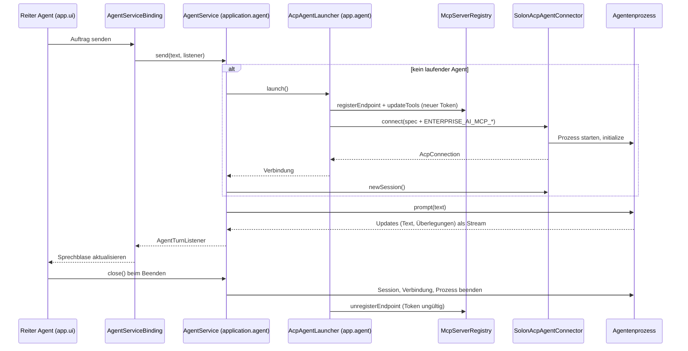

# ACP: Agent-Modus

ACP (Agent Client Protocol) ist das Protokoll, über das die Anwendung einen **externen Agentenprozess** steuert:
Prozess starten, Verbindung initialisieren, Session anlegen, Prompts schicken, Updates (Text, Überlegungen,
Tool-Aufrufe) streamen, abbrechen. Der normale Chat funktioniert vollständig ohne ACP; der Agent-Modus ist ein
optionaler Zusatz mit eigenem Reiter, eigenem Transkript und eigener Session.

## Module

```
acp-client-api   neutrale Verträge (keine SDK-, Reactor-, Solon- oder Swing-Typen)
      ↑
acp-solon-client Adapter über org.noear:acp-sdk:3.10.1 (STDIO-Transport)
acp-demo-agent   Testfixture: externer Demo-Agent als Fat-Jar, von keinem Modul referenziert
```

Alle drei Module stammen aus askai-java8 (`acp-client-api`, `acp-solon-client`, `acp-demo-agent`), hier mit
anderem Paket, `toString()` ohne Secrets und einigen Härtungen (Tests ohne Token in Ausgaben, Wire-Reihenfolge
der Updates, Listener-Thread). ACP wurde nicht neu implementiert.

### Verträge in `acp-client-api`

Vier getrennte Lebenszyklen:

| Ebene | Typen | Zustände |
|---|---|---|
| Prozess | `AgentLaunchSpec` (Kommando, Argumente, Umgebung; `toString()` zeigt nur Variablennamen), `AgentProcessHandle` | läuft / beendet |
| Verbindung | `AcpAgentConnector.connect(spec)` → `AcpConnection` | `AcpConnectionState` |
| Session | `AcpConnection.newSession()` → `AcpSession` | `AcpSessionState`, mehrere Prompts nacheinander |
| Prompt | `AcpSession.prompt(text, AcpUpdateListener)` → `PromptHandle` | `AcpPromptState`, genau ein Terminal (fertig, abgebrochen, gescheitert) |

`AcpStates` prüft die Zustandsübergänge zentral; `PromptDispatcher` ist der wiederverwendbare Reihenfolge- und
Terminal-Wächter, den jeder Adapter für seine Prompt-Läufe nutzt. `AcpEndpointDescriptor` beschreibt einen
MCP-Endpoint (ID, URL, Transport, Token) für die Übergabe an den Agenten; `Redaction` maskiert Tokens in
Ausgaben. Updates (`AcpUpdate`) unterscheiden Nachrichtentext, Überlegungen und sonstige Kinds.

## Ablauf in der Anwendung



- **`AgentService`** (`application.agent`) hält Prozess, Verbindung und eine Session, höchstens einen Auftrag
  gleichzeitig und ein eigenes Transkript, getrennt vom `ChatService`. Ein Abbruch endet erst, wenn der Agent
  ihn bestätigt; ein zwischen zwei Aufträgen beendeter Agent wird beim nächsten Auftrag ersetzt (neue Session,
  alter Kontext verloren); einen automatischen Neustart ohne Nutzeraktion gibt es nicht. Fehler sind
  `AgentFailure` (`START_FAILED`, `SESSION_FAILED`, `PROMPT_FAILED`, `AGENT_TERMINATED`, `CLOSED`) ohne Details
  aus Agent oder SDK.
- **`AgentLauncher`** ist das Port-Interface des Use Case; die Implementierung `app.agent.AcpAgentLauncher`
  liegt in der Composition Root. Dadurch laufen Launch-Umgebung, Endpoint-URL und Token nie durch den Use Case.
- **MCP-Übergabe**: Je Agentenprozess registriert der Launcher einen frischen Endpoint (neuer Token) und legt
  ihn als Umgebungsvariablen in den Prozess (`AgentMcpEnvironment`): `ENTERPRISE_AI_MCP_ENDPOINT_ID`,
  `ENTERPRISE_AI_MCP_URL`, `ENTERPRISE_AI_MCP_TRANSPORT`, `ENTERPRISE_AI_MCP_TOKEN`. Der Agent erfährt den
  Endpoint also strukturiert, nie als Prompt-Text. Beim Schließen von Verbindung oder Agent-Modus wird der
  Endpoint abgemeldet. ACP `session/new` selbst sendet eine leere `mcpServers`-Liste; eine Übergabe über ACP
  wäre eine Vertragsänderung in `acp-client-api` und `acp-solon-client` (siehe
  [Einschränkungen](einschraenkungen.md)).
- **Oberfläche**: `app.ui.agent.ModalShellPanel` mit Reitern "Chat" und "Agent" (`ModeSwitchBar`, ein
  `ComicToggleButton`). Jeder Reiter ist eine eigene `ChatShellPanel` mit eigenem Model; Verläufe und Sessions
  mischen sich nicht. Überlegungen des Agenten stehen im Transkript, nicht in der Antwortblase; Tool-Updates
  zeigt die Oberfläche derzeit nicht.

Architekturtest `AgentModeBoundaryTest`: Der Chat-Pfad (`domain.chat`, `chat.api`, `chat.openai`,
`application.chat`, `app.chat`, `app.ui.chat`) kennt weder ACP noch MCP; ACP- und MCP-Typen kommen außerhalb
ihrer Module nur in `application.agent`, `application.mcp`, `app.agent` und der Composition Root vor;
`application.agent` sieht nur den ACP-Port; `app.ui.agent` ist reine Oberfläche.

## Konfiguration (`agent.*`)

```properties
agent.enabled=false
#agent.command=java
#agent.args=-jar "/pfad/zu/acp-demo-agent-all.jar"
agent.requestTimeoutSeconds=30
agent.mcpEndpointId=agent-tools
agent.mcpDisplayName=Wissenswerkzeuge
agent.tools.maxResponseChars=20000
agent.tools.snippetChars=600
agent.tools.defaultMaxResults=5
agent.tools.maxFailuresListed=20
```

`agent.args` wird wie eine Shell-Zeile zerlegt (Leerzeichen trennen, Anführungszeichen fassen zusammen,
Backslash maskiert). Der Agent muss ACP über STDIO sprechen; STDOUT gehört ausschließlich dem Protokoll. Ein
Prozessende wird erst beim nächsten Request oder Request-Timeout erkannt (Standard 30 s).

## Der Demo-Agent

`acp-demo-agent` (`DemoAcpAgentMain`, aus askai-java8) ist ein Java-8-Prozess, der auf jeden Prompt eine
Überlegung und mehrere Textstücke streamt. Er dient den Roundtrip-Tests (`SolonAcpRoundTripTest`,
`AgentModeRoundTripTest`) und der Demo `./gradlew :app-swing:runAgentDemo`. Testhaken im Prompt: `slow`
streamt gedrosselt, bis abgebrochen wird (20 ms je Nachricht, höchstens 500), `crash` beendet die JVM mitten im
Turn, `count N` liefert nummerierte Stücke, `hang` schweigt drei Sekunden. Der Demo-Agent **ruft selbst keine
MCP-Werkzeuge auf**; belegt ist damit die Verdrahtung, nicht ein Werkzeugaufruf. Den Nachweis, dass ein Agent
die Wissenswerkzeuge über MCP nutzt, erbringt `SliceGAgentMcpTest` in `integration-tests` mit dem Testagenten
`KnowledgeDemoAgentMain` (Testcode, eigener Kindprozess, Endpoint aus `ENTERPRISE_AI_MCP_*`, MCP nur über
`McpToolClientFactory`/`SolonMcpToolClientFactory`); siehe [Tests](tests.md#vertical-slice-tests-ag-integration-tests).

Bauen: `./gradlew :acp-demo-agent:demoAgentJar` → `acp-demo-agent/build/libs/acp-demo-agent-all.jar`. Die
Roundtrip-Tests starten dieses Jar auf derselben JVM wie der Build (unter JDK 8 also als echter
Java-8-Kindprozess) und dürfen im Gradle-Lauf nicht übersprungen werden (`acp.roundtrip.required=true`).
