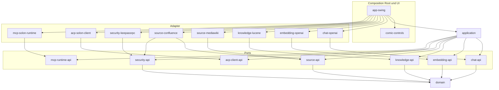
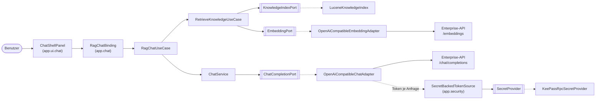

# Architektur

Ports-and-Adapters (Hexagonal) mit strikter Richtung von außen nach innen. Die verbindliche Fassung mit allen
Konventionen ist [ARCHITECTURE.md](../ARCHITECTURE.md); diese Seite ist die Einführung dazu.

## Schichten

```
UI / Adapter
     ↓
Application (Use Cases)
     ↓
Domain + Ports (*-api)
```

- **Domain** (`domain`): providerneutrale Werttypen ohne Abhängigkeiten.
- **Ports** (`*-api`): Interfaces plus port-spezifische Request-, Response- und Listener-Typen. Keine
  Implementierung, keine Provider-Typen.
- **Application** (`application`): Use Cases gegen Ports. Kennt keinen Adapter, kein Swing, kein HTTP.
- **Adapter** (`chat-openai`, `embedding-openai`, `knowledge-lucene`, `source-mediawiki`, `source-confluence`,
  `security-keepassrpc`, `acp-solon-client`, `mcp-solon-runtime`): je genau eine technische Integration hinter
  genau einem Port. Technische DTOs, JSON und Fremdbibliotheken bleiben paketintern.
- **UI** (`comic-controls`, `app-swing`): Swing/Java2D. `app-swing` ist zugleich die einzige Composition Root.

## Modulgraph



Nicht gezeichnet: `acp-demo-agent` (Testfixture, hängt von keinem Modul ab, kein Modul hängt davon ab) und
`architecture-tests` (liest nur kompilierte Klassen). `acp-client-api` und `mcp-runtime-api` dürfen `domain`
sehen, nutzen es aber nicht.

Verbotene Kanten, die die Tests ausdrücklich rot machen:

- `domain → irgendein Modul`
- `*-api → Adapter`, `*-api → application`, `*-api → anderer Port`
- `application → konkreter Adapter`
- `Adapter → anderer Adapter`, `Adapter → application`, `Adapter → app-swing`
- jede Abhängigkeit auf `app-swing`, `acp-demo-agent` oder `architecture-tests`

## Laufzeitsicht



Die gestrichelten Kanten entstehen nur in der Composition Root (`app.composition.AdapterAssembly`,
`CompositionRoot`): Dort werden Adapter gebaut und in die Use Cases injiziert. Der Chat-Pfad funktioniert
vollständig ohne RAG, ACP und MCP; RAG legt sich von außen um den `ChatService`, der Agent-Modus ist ein
getrennter Zusatz (siehe [RAG-Datenfluss](rag-datenfluss.md), [ACP](acp.md), [MCP](mcp.md)).

## Grundsätze

- **Konstruktor-Injektion überall**, keine globalen Singletons, kein `ServiceLoader`, kein nicht-finales
  `static`. Konfiguration sind unveränderliche Snapshots, die nur `app-swing` aus der Properties-Datei liest.
- **Technische Typen bleiben im Adapter.** Öffentliche Signaturen aller Adapter zeigen keine Bibliotheks- oder
  Transporttypen; Fremdbibliotheken werden mit `implementation` deklariert.
- **Secrets**: `SecretRef` (ein Titel, loggbar) darf durch Konfiguration und Use Cases laufen,
  `SecretMaterial` nicht. Klartext existiert nur im Security-Adapter, im konsumierenden Adapter (Confluence)
  und in den Brücken `app.security`, immer nur für die Dauer eines Aufrufs, nie in einem Feld, nie in Logs,
  Exceptions, `toString()`, Chat-Historie oder Indizes.
- **Kein Logging-Framework.** Der Kern loggt nicht; Adapter und Composition Root nutzen höchstens
  `java.util.logging`. Konsolenausgabe gibt es nur im Demo-Agenten.
- **Keine Provider-Namen im Kern**, keine Multi-Provider-Abstraktion, keine URL mit fremdem Host, kein
  Modellname und kein Key-Literal im Konstantenpool des Produktionscodes. Modelle und Endpunkte sind
  Konfiguration.
- **Java 8**: `--release 8` auf neueren JDKs, Bytecode-Major 52 in allen Klassendateien, keine Java-9+-APIs.
  CI baut mit JDK 8 und JDK 21.

## Regeln

Die Regeln sind als ArchUnit- und Build-Modell-Tests im Modul `architecture-tests` ausführbar
(`./gradlew :architecture-tests:test`). Jede automatisierte Regel hat ein Gegenbeispiel im Testcode
(`<Modulpaket>.archfixture..`), gegen das sie nachweislich rot wird. Die Tabelle aller Testklassen steht in
ARCHITECTURE.md, Abschnitt "Architekturtests"; eine Übersicht der Regelgruppen:

| Gruppe | Beispiele | Testklassen |
|---|---|---|
| Modulschnitt und Richtung | Registry ↔ `settings.gradle`, erlaubte Kanten auf Klassen- und Gradle-Ebene, ein Basispaket je Modul | `BuildModelTest`, `ClassBoundaryTest`, `ModuleRegistryTest`, `SettingsGradleTest` |
| Technologiegrenzen | Swing nur in UI, Lucene nur in knowledge-lucene, Solon/ACP-SDK/Reactor nur in ihren Adaptern, Positivliste des Kerns | `ClassBoundaryTest`, `UiTechnologyTest` |
| Adapter-Grenzen | keine Bibliothekstypen in öffentlichen Signaturen, keine Bibliothek als `api`, jeder Adapter implementiert ein Interface seines Ports | `AdapterSignatureTest`, `CompositionRootTest`, `ChatBoundaryTest`, `EmbeddingBoundaryTest`, `KnowledgeBoundaryTest`, `SourceBoundaryTest` |
| Strang-Grenzen | Chat-Pfad kennt kein RAG/ACP/MCP; `application.mcp` nur über Use Cases; UI ohne Ports | `RagBoundaryTest`, `AgentModeBoundaryTest`, `McpKnowledgeToolsBoundaryTest`, `ComicUiBoundaryTest` |
| Composition Root | Adapterkonstruktoren nur in `app.composition`; `System.getenv`/Preferences/`Properties.load` nur in app-swing; kein `ServiceLoader` | `CompositionRootBoundaryTest`, `CompositionRootTest` |
| Secrets und Logging | `SecretMaterial` nur in erlaubten Modulen und nie in Feldern; kein Logging-Framework, keine Konsole | `SecretBoundaryTest`, `LoggingBoundaryTest` |
| Provider-Neutralität | keine Provider-Namen im Kern, keine Hosts/Modelle/Keys im Bytecode, kein `0.0.0.0` | `CoreNamingTest`, `HardcodedConfigurationTest` |
| Testcode und Java 8 | Produktionscode kennt keine Testbibliothek und keine Fixtures; `--release 8` und Bytecode 52 überall | `TestCodeIsolationTest`, `Java8CompatibilityTest` |
| Selbsttests | jede Regel wird gegen ihr Gegenbeispiel rot | `RulesDetectViolationsTest`, `TechnologyRulesDetectViolationsTest`, `ModuleMatrixDetectViolationsTest`, `ExistingRulesDetectViolationsTest` |

Nicht automatisierbar und deshalb Konvention beziehungsweise Review-Gegenstand: Inhalte von Exceptions und
`toString()` (Secrets), Konstruktor-Injektion jenseits der statischen Umgehungen, `System.getProperty` nur für
JVM-Schlüssel, Tests ohne externe Dienste, Gestaltung im Comic-Stil, Java-9+-APIs (fängt `--release 8` beim
Kompilieren ab).

## Neues Modul aufnehmen

1. `include` in `settings.gradle`; `build.gradle` mit Abhängigkeiten nur in erlaubter Richtung.
2. Eintrag in `architecture-tests/src/test/java/.../ModuleRegistry.java` (Name, Basispaket, Rolle, Strang,
   erlaubte Abhängigkeiten). Bei neuer Fremdtechnologie auch `Technology` und
   `ArchitectureRules.confinedTechnologies()`.
3. Zeile in der Modultabelle von ARCHITECTURE.md und in der [Modulübersicht](module.md).
4. Eine neue Wissensquelle (z. B. SharePoint, lokale Dateien) implementiert `source-api`, erbt den
   `KnowledgeSourceContractTest` aus dessen Testfixtures und wird in `AdapterAssembly` gebaut; Kern und
   `application` bleiben unverändert.

Ohne Schritt 2 wird `BuildModelTest.everyGradleModuleIsRegistered` rot.
