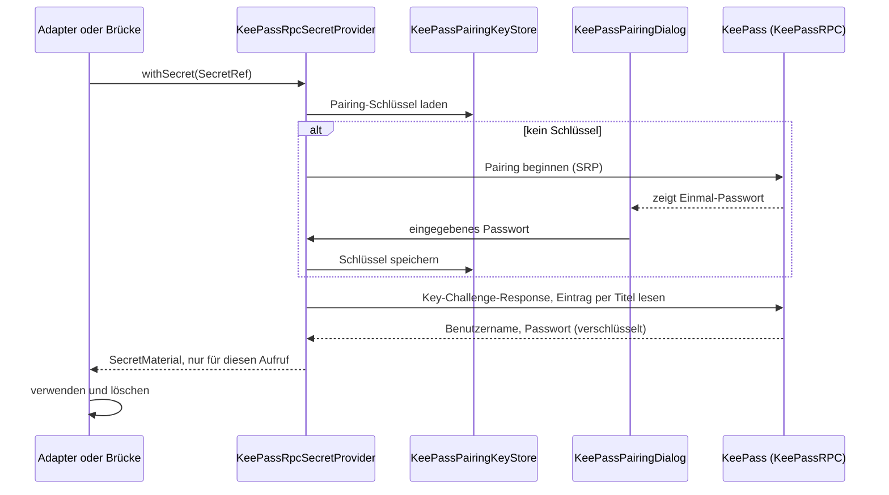

# KeePass-Konfiguration (KeePassRPC)

Secrets (API-Key, Wiki- und Confluence-Zugangsdaten, Passwort eines Client-Zertifikats) liegen in KeePass. Die
Anwendung spricht KeePass über das Plugin **KeePassRPC** (KeePass 2.x) an. In der Konfigurationsdatei stehen
nur Referenzen auf Einträge; Secret-Material erreicht weder Datei, Log, Chat-Historie noch Index.

## Voraussetzungen

- KeePass 2.x mit installiertem KeePassRPC-Plugin, Datenbank entsperrt. KeePassRPC lauscht standardmäßig auf
  `127.0.0.1:12546`.
- Die Anwendung meldet sich mit einem Origin an, den KeePassRPC akzeptieren muss. Standard ist
  `chrome-extension://enterpriseaiclient`; KeePassRPC lehnt Verbindungen ohne erlaubten Origin stillschweigend
  ab.

## Schlüssel (`security.keepass.*`)

```properties
security.keepass.enabled=true
security.keepass.host=127.0.0.1
security.keepass.port=12546
security.keepass.origin=chrome-extension://enterpriseaiclient
security.keepass.clientId=EnterpriseAiClient
security.keepass.clientDisplayName=Enterprise AI Client
security.keepass.timeoutMillis=15000
security.keepass.pairingKeyStore=file        # file (Standard) oder memory
#security.keepass.pairingKeyFile=/pfad/zu/keepassrpc-pairing.key
```

| Schlüssel | Bedeutung |
|---|---|
| `enabled` | `false`: Die Anwendung startet ohne KeePass mit einem `UnavailableSecretProvider`; ein Dialog und das Log nennen die fehlenden Secrets, jede Anfrage, die ein Secret braucht, scheitert mit einem Authentifizierungsfehler. |
| `clientId` | Kennung, unter der KeePassRPC das Pairing speichert (SRP-Benutzername). |
| `clientDisplayName` | Name, den KeePass im Pairing-Dialog anzeigt. |
| `pairingKeyStore` | `file`: Pairing-Schlüssel dauerhaft in `pairingKeyFile` (Standard `<Anwendungsverzeichnis>/keepassrpc-pairing.key`), Dateirechte nur für den Besitzer, atomar ersetzt, beim Verwerfen überschrieben. `memory`: nur im Prozess, nach jedem Start neues Pairing. |

## Secret-Referenzen

Eine Referenz ist der Titel eines KeePass-Eintrags, optional mit Präfix `keepass:`:

```properties
chat.apiKeyRef=keepass:Enterprise AI API
embedding.apiKeyRef=keepass:Enterprise AI API
source.wiki.credentialRef=keepass:Intranet-Wiki
source.confluence.credentialRef=keepass:Confluence
source.confluence.clientCertificate.keyStorePasswordRef=keepass:Client-Zertifikat
```

| Verwendung | Welche Felder des Eintrags |
|---|---|
| API-Key für Chat und Embeddings | Passwortfeld (als Bearer-Token gesendet, Rand-Whitespace entfernt) |
| MediaWiki-Login | Benutzername und Passwort |
| Confluence | Benutzername und Passwort → `Basic`; nur Passwort ohne Benutzername → `Bearer` (Personal Access Token, UNVERIFIED) |
| PKCS12-Passwort (Confluence-mTLS) | Passwortfeld |

Der Titel muss exakt übereinstimmen; es wird kein Suchen über URL oder Benutzername gemacht. Kein Eintrag mit
dem Titel → `SecretUnavailableException(NOT_FOUND)`.

## Ablauf



- Jede Auflösung nutzt eine eigene, kurze Verbindung (Muster aus MainframeMate `KeePassProvider`). Es gibt
  keinen Cache: Jede Chat-Anfrage und jede Embedding-Anfrage holt den Key neu; bei großer Indexierung ist das
  spürbar, KeePass muss entsperrt bleiben.
- Lehnt KeePass den gespeicherten Schlüssel ab (Pairing in KeePass widerrufen), wird er verworfen und genau
  einmal neu gepairt.
- Der Pairing-Dialog (`app.ui.security.KeePassPairingDialog`) läuft modal auf dem Event-Dispatch-Thread; der
  Adapter ruft den Callback auf einem Arbeits-Thread. Headless oder Abbruch → `CANCELLED`.
- Fehlerabbildung: KeePass nicht erreichbar → `NOT_AVAILABLE`; Eintrag fehlt → `NOT_FOUND`; Passwort falsch
  oder Schlüssel weiter abgelehnt → `ACCESS_DENIED`; Pairing abgebrochen → `CANCELLED`.

## Sicherheitsregeln im Code

- `SecretRef` ist loggbar; `SecretMaterial` (ein `char[]`, `close()` löscht) lebt nur für die Dauer von
  `SecretProvider.withSecret`. Kein Feld in irgendeinem Modul hält `SecretMaterial` (`SecretBoundaryTest`).
- Klartext kommt nur in `security-api`, `security-keepassrpc`, `source-confluence` und im Paket
  `app.security` vor. Die Brücken `SecretBackedTokenSource` (Chat) und `SecretBackedBearerTokenSource`
  (Embeddings) kopieren den Key je Anfrage und löschen ihn danach.
- Bekannte Grenze: Der Chat-Adapter verlangt den Token als `String` (`OpenAiCompatibleChatConfig.TokenSource`),
  der sich nicht überschreiben lässt und bis zur Garbage Collection lebt. Eine `char[]`-Variante wäre eine
  Vertragsänderung in `chat-openai`.
- Die Kryptografie des KeePassRPC-Protokolls (SRP-Pairing, AES-verschlüsseltes JSON-RPC, Key-Challenge-
  Response) ist aus MainframeMate übernommen; übernommen ist nur das Lesen von Einträgen, kein
  Anlegen oder Ändern. Nachrichteninhalte werden nicht geloggt.

## Test gegen ein echtes KeePass

Alle regulären Tests laufen gegen `FakeKeePassRpcServer`. Ein optionaler Integrationstest gegen ein echtes
KeePass ist standardmäßig übersprungen:

```bash
./gradlew :security-keepassrpc:test --tests '*KeePassRpcRealServerIT' --console=plain --no-daemon \
    -Dkeepassrpc.it=true -Dkeepassrpc.it.entry="Titel eines Testeintrags" \
    [-Dkeepassrpc.it.keyFile=/pfad/zum/pairing-key] [-Dkeepassrpc.it.port=12546] [-Dkeepassrpc.it.host=127.0.0.1]
```

Ohne `keyFile` fragt der Test das Einmal-Passwort auf der Konsole ab. Ausgegeben wird nur, ob Benutzername
und Passwort nicht leer sind, nie die Werte. Der Handschlag mit einem echten KeePassRPC-Plugin und das
Pairing über den Swing-Dialog sind bisher nicht gegen eine echte Installation geprüft (UNVERIFIED).
