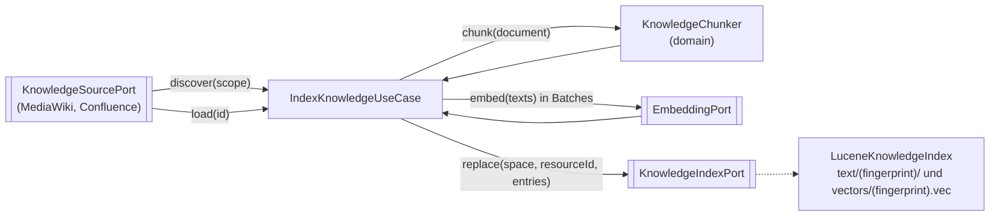
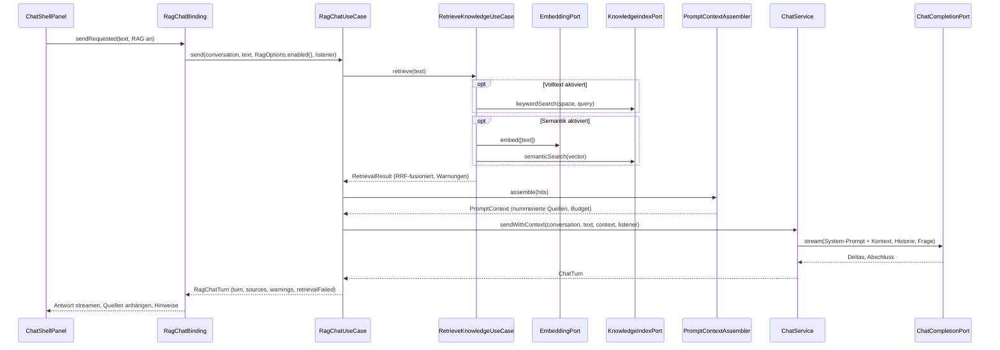

# RAG-Datenfluss

Retrieval-Augmented Generation legt sich von außen um den normalen Chat: Vor der Antwort sucht die Anwendung
in der Wissensbasis und gibt dem Modell nummerierte Auszüge als Kontext mit. Der Chat-Pfad selbst kennt RAG
nicht (`RagBoundaryTest.plainChatPathDoesNotKnowRag`). Alle Use Cases liegen in `application` und sprechen
nur mit Ports.

## Indexierung



`IndexKnowledgeUseCase.indexSource(source, scope, listener)` arbeitet seriell und blockierend (die UI startet
einen Arbeits-Thread):

1. **Discover**: `KnowledgeSourcePort.discover(SourceScope)` liefert Ressourcen ohne Inhalt, mit Titel, Ort und
   Revision. Startpunkte, Tiefe und Höchstzahl kommen aus der Quellkonfiguration.
2. **Überspringen**: Gleicht die bekannte Discovery-Revision der im Index gespeicherten
   (`KnowledgeIndexPort.revisionOf`), wird die Ressource als `UNCHANGED` übersprungen (weder geladen noch
   vektorisiert). Unbekannte Revision gilt als verändert.
3. **Load**: `load(id)` liefert das `KnowledgeDocument` (Klartext mit leichtgewichtigem Markdown, NFC-normalisiert,
   SHA-256 über den Inhalt). Weiterleitungen tragen die ID der Zielseite. `NOT_FOUND` entfernt die Chunks der
   Ressource (`REMOVED`), leerer Text ergibt `EMPTY`.
4. **Chunking**: `KnowledgeChunker` (`domain.knowledge`) zerlegt entlang Überschriften und Sätzen mit
   Token-Budget (`knowledge.chunk.maxTokens`, Standard 350) und Satz-Overlap (`knowledge.chunk.overlapSentences`,
   Standard 1). Chunk-IDs sind deterministisch; der Text eines Chunks für das Embedding ist
   `chunk.textWithHeading()`.
5. **Embedding**: `EmbeddingPort.embed` in Batches (`knowledge.embeddingBatchSize`, Standard 16). Jeder Vektor
   trägt die `EmbeddingModelIdentity` (Modell, Dimension, Fingerprint).
6. **Index**: `KnowledgeIndexPort.replace(space, resourceId, entries)` ersetzt alle Chunks der Ressource im
   Namespace atomar. Der Index ist der letzte Schritt; scheitert etwas davor, bleibt der alte Stand.
7. **Bereinigung**: Am Ende eines vollständigen Laufs werden Ressourcen der Quelle, die der Index noch kennt
   (`resourceIds`), die Discovery aber nicht mehr geliefert hat, aus dem eigenen Namespace entfernt (`PRUNED`).
   Ein Abbruch oder eine gescheiterte Discovery entfernt nichts; eine leere, aber gelungene Discovery räumt die
   Quelle leer.

Fehler werden je Ressource mit Stufe (`DISCOVERY`, `LOADING`, `EMBEDDING`, `INDEXING`) im `IndexingReport`
gesammelt; nur eine gescheiterte Discovery beendet den Lauf. `IndexingListener.isCancelled()` wird zwischen
zwei Ressourcen geprüft. Der Index ist ausschließlich eine wiederherstellbare Projektion: Kanonisch sind die
Dokumente der Quellen; `rebuild` baut ihn aus Einträgen neu auf.

Auslöser: `knowledge.indexOnStartup=true` (Standard) indexiert beim Start alle Quellen nacheinander über die
`KnowledgeIndexingBinding` (Statuszeile mit Abbrechen-Knopf, `app.knowledge.StartupIndexing`); ein Agent kann
`refresh_knowledge_source` aufrufen ([MCP](mcp.md)). Berichte landen im Log, nicht im Chat.

## Namespaces

Jeder Index-Eintrag gehört über die `EmbeddingModelIdentity` seines Vektors zu genau einem Namespace
(SHA-256 über Modell-ID, Dimension und Konfigurationsmerkmale; ohne URL, Timeouts oder Secrets). Suchen laufen
immer in genau einem Namespace; Vektoren verschiedener Embedding-Welten werden nie verglichen
(`EmbeddingWorldMismatchException`). `LuceneKnowledgeIndex` legt dafür `text/<fingerprint>/` (BM25) und
`vectors/<fingerprint>.vec` (exakter Cosinus, linearer Scan) an.

## Retrieval und Chat



- **Hybride Suche** (`RetrieveKnowledgeUseCase`): nacheinander Volltext (BM25) und dann Cosine (Embedding der
  Frage, dann Vektorsuche) im Namespace der konfigurierten `EmbeddingModelIdentity`, beides synchron auf dem
  aufrufenden Arbeits-Thread, je `retrieval.keywordCandidates`/`semanticCandidates` (Standard 20) Kandidaten,
  Fusion per **Reciprocal Rank Fusion** mit `retrieval.rankConstant` (Standard 60) und Gewichten
  (`keywordWeight`, `semanticWeight`, Standard 1.0), Dedupe je Chunk-ID, höchstens `retrieval.maxResults`
  (Standard 10). RRF ersetzt die lineare Score-Normalisierung aus MainframeMate, weil BM25- und Cosine-Scores
  nicht vergleichbar sind. Fällt ein Pfad aus (`KnowledgeIndexException`, `EmbeddingException`), liefert der
  andere allein mit `RetrievalWarning`; fallen alle aus, ist das `KnowledgeRetrievalException`.
- **Kontext** (`PromptContextAssembler`): Hinweis, `--- KONTEXT ---`, je Quelle `[n] Titel – Überschrift`,
  `Quelle: … | Ort: … | Stand: …`, Chunk-Text, `--- ENDE KONTEXT ---`. Aufnahme in Fusionsreihenfolge bis
  `context.maxTokens` (Standard 1500, Schätzung über Wörter und Symbole, kein Modell-Tokenizer) oder
  `context.maxSources` (Standard 6). Rahmenmarker in Quelltexten werden neutralisiert; Ressourcen-Metadaten
  gehen nicht in den Prompt.
- **Chat** (`ChatService.sendWithContext`): Der Kontext wird als System-Anteil an den System-Prompt angehängt
  und gilt nur für diesen Turn. In der Historie stehen nur die unveränderte Nutzerfrage und die Antwort;
  spätere Turns sehen den Kontext nicht. Die Rolle `developer` wird nie verwendet. RAG aus
  (`RagOptions.disabled()`) ist exakt `ChatService.send`.
- **Shell** (`app.chat.RagChatBinding`, AP22): Während der Suche zeigt die leere Antwortblase "Wissen wird
  gesucht …"; danach hängen die Quellen (`SourceReference`: Nummer, Titel, Überschrift, Ort, Stand, Score,
  Ränge) einklappbar an der Antwort. Warnungen, keine Treffer oder ein Ausfall der Suche werden eine eigene
  Hinweis-Blase. Stop während der Suche bricht den Turn ab, sobald er existiert; die Frage bleibt in der
  Historie. Suche und Indexierung laufen auf einem Arbeits-Executor, nie auf dem Event-Dispatch-Thread.

## Der Index führt

Entscheidung aus AP20 (Koordinator-Default, empfohlene Option der Entscheidungskarte an Angelo; umgesetzt in
PR #28 und #32): Der Agent und die Wissenswerkzeuge sehen genau den Korpus, den die Indexierung im
konfigurierten Scope aufgebaut hat. Der Scope (Startpunkte, Tiefe, Höchstzahl) ist ohne Crawl nicht auf eine
einzelne ID anwendbar; der Index ist sein Abdruck.

Konsequenzen:

- `get_knowledge_document` liefert nur Dokumente, die im Namespace der konfigurierten Embedding-Welt indexiert
  sind, und lädt sie aus der Quelle, unter der sie indexiert sind (`LoadKnowledgeDocumentUseCase(catalog,
  index, space)`); alles andere ist `KnowledgeDocumentNotIndexedException`, ohne dass eine Quelle gefragt wird.
- Eine neue Seite ist erst nach `refresh_knowledge_source` oder einem Start mit Indexierung lesbar; eine leere
  Seite ist nie lesbar.
- Unveränderte Seiten werden anhand der Revision der Quelle übersprungen; liefert eine Quelle keine Revision,
  wird bei jedem Lauf alles neu geladen. Verschwundene Seiten werden nach einem vollständigen Lauf entfernt;
  Weiterleitungsziele und Ressourcen, deren Laden im Lauf scheiterte, bleiben.
- Falls anders entschieden wird: Der Konstruktor `LoadKnowledgeDocumentUseCase(catalog)` ohne Index (Quellen
  entscheiden per `UNSUPPORTED`) ist erhalten; das Entfernen in `indexSource` ist heute immer aktiv und hätte
  einen Schalter zu bekommen.

## Konfigurationsschlüssel

```properties
knowledge.indexDirectory=<Anwendungsverzeichnis>/index
knowledge.indexOnStartup=true
knowledge.chunk.maxTokens=350
knowledge.chunk.overlapSentences=1
knowledge.embeddingBatchSize=16
retrieval.keywordEnabled=true
retrieval.semanticEnabled=true
retrieval.keywordCandidates=20
retrieval.semanticCandidates=20
retrieval.keywordWeight=1.0
retrieval.semanticWeight=1.0
retrieval.rankConstant=60
retrieval.maxResults=10
retrieval.minSemanticScore=-1
context.maxTokens=1500
context.maxSources=6
#context.instruction=Beantworte die Frage anhand der folgenden Auszüge.
```

## Grenzen

- Das Token-Budget ist eine Schätzung; mit Abstand unter dem Kontextfenster des Modells wählen.
- Overlap-Chunks derselben Ressource können im Kontext doppelt zitiert werden.
- Die Unicode-Klassifizierung im Satz- und Tokensplitter ist JDK-abhängig; Chunks sollen unter JDK 8 und
  neueren JDKs identisch sein, eine eigene Zeichentabelle gibt es nicht (Frage an Angelo offen).
- Ein Backend, das vor dem Stop fertig wird, gewinnt: Die Antwort steht dann vollständig.
- Hinweis-Blasen erscheinen hinter der Antwortblase, nicht davor.
